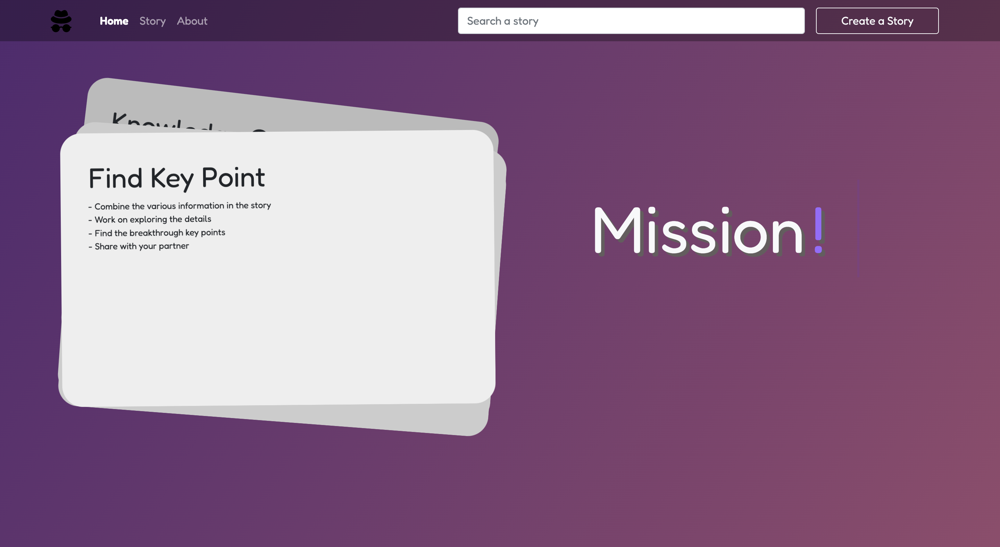
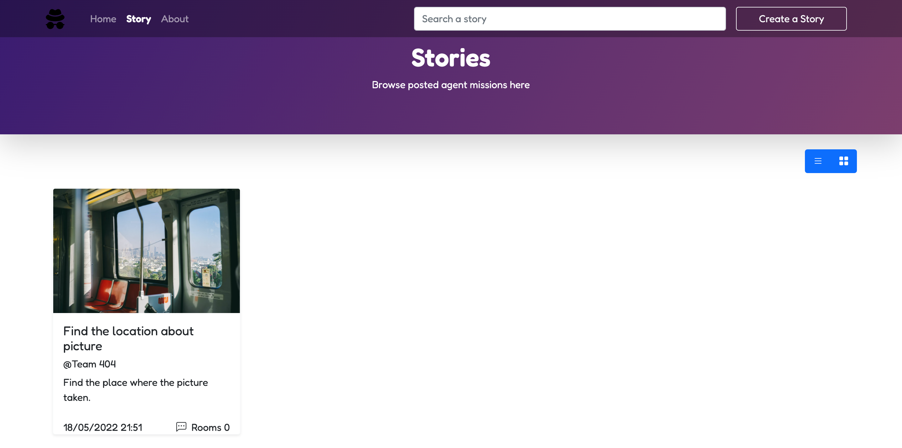
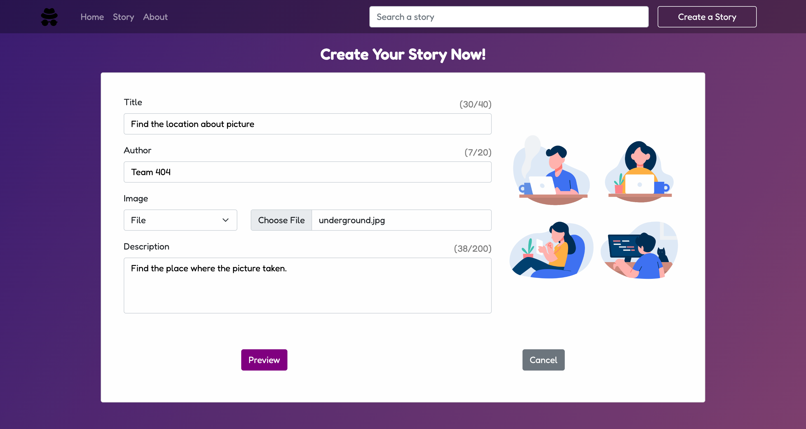
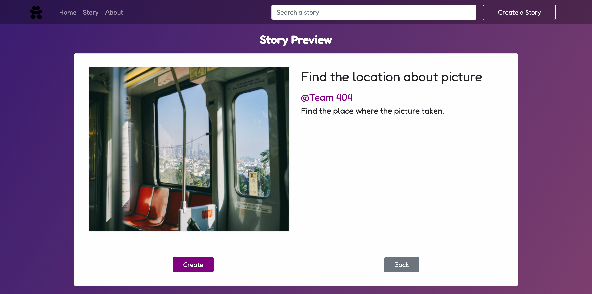
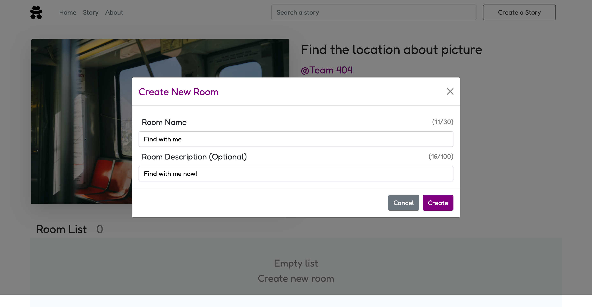
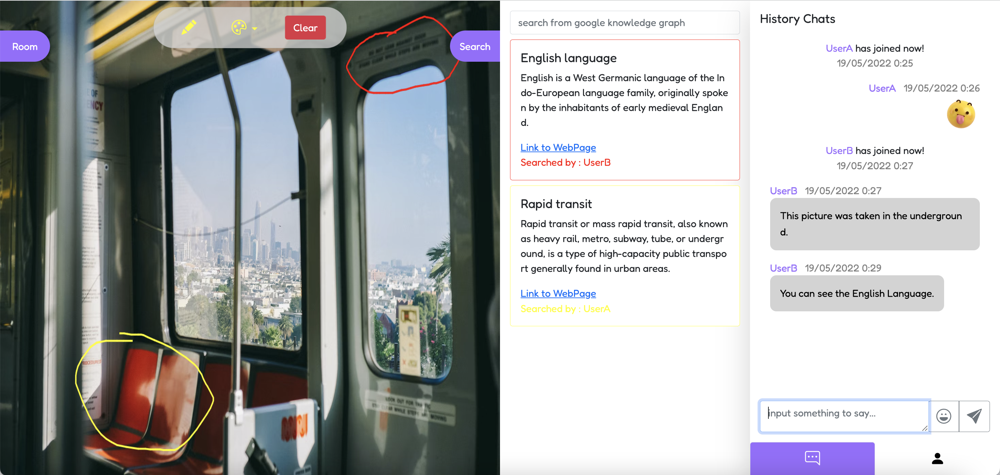
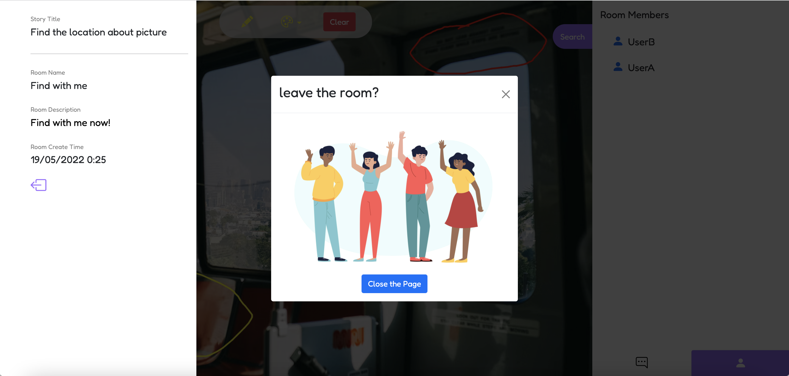
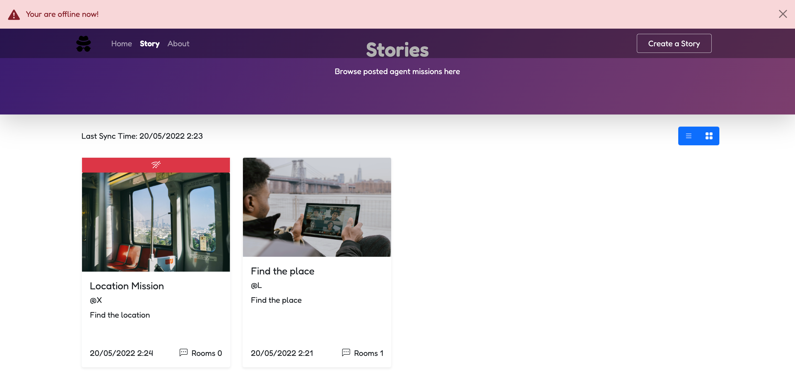
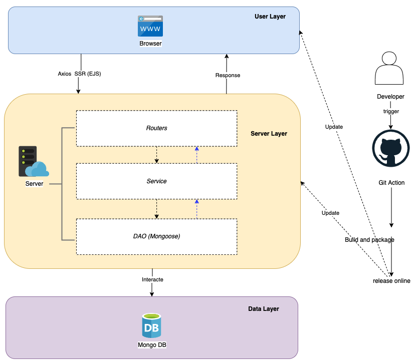

# 404-Group-COM6504-Assignment

## Project Info: Mission!

### Name: Mission!

### Participants

- Jiaqi Fu : jfu15@sheffield.ac.uk
- Lixuan Lou : llou1@sheffield.ac.uk
- Xu Li : xli327@sheffield.ac.uk

### Runtime Environment

- **Browser** (Google, Firefox, Safari)

## Screenshots

### Web Application

### Create Your Story

### Interact In A Room

### Support Offline

## Architecture Design

## Setup Step
1. Use `nmp install` to install packages
2. Use `mongodb://localhost:27017/mission` to connect to mongoDB
3. Use `nmp start` to start 
4. Browse http://localhost:3000/  
5. Browse http://localhost:3000/swagger/

## Tech Stack

Language: **Javascript (>=ES6)**

UI: **Bootstrap 5.0**

Server: **Express**

Database: **MongoDB**

Other Libraries: **Axios**, **JQuery**, **Mongoose**

## Feature List

### Completed ✅

1. Browse the stories created by various users 
2. Browse specific story details and related rooms list
3. Create rooms in a specific story 
4. Create a new story with title, description, author name, and story image 
5. Make annotations on the picture in the chat room 
6. Different users can chat in the same room in real time
7. Use Google Knowledge Graph to search for keywords in the room and get a list of relevant Knowledge Graph content cards
8. Store the history messages and annotation into the IndexDB 
9. File uploaded from local 
10. Display the online users of the room in real time
11. Support offline mode
12. Render room information 
13. Support service worker
14. Provide the javascript document in terms of javadoc
15. Export the swagger document offline

## Development Logs

- **Version**: `Beta 3.0` (Current)

>1. File uploaded from local 
>2. Display the online users of the room in real time
>3. Support offline mode 
>4. Render room information
>5. Support service worker
>6. Provide the javascript document in terms of javadoc
>7. Export the swagger document offline

- **Version**: `Beta 2.0`

> 1. Swagger Document integration.
> 2. Complete the interaction of frontend page of room.
> 3. APIs updated
> 4. IndexDB enhancement
> 5. Optimise the project structure using ES6 Module
> 6. Socket function enhancement including server and client
> 7. Canvas implementation.

- **Version**: `Beta`

> 1. Infrastructure set-up including MongoDB, Project Structure
> 2. Initial frontend implementation
> 3. Google Knowledge Graph integration
> 4. Socket function implementation including server and client
> 5. Basical indexDB implementation
> 6. APIs implementation
